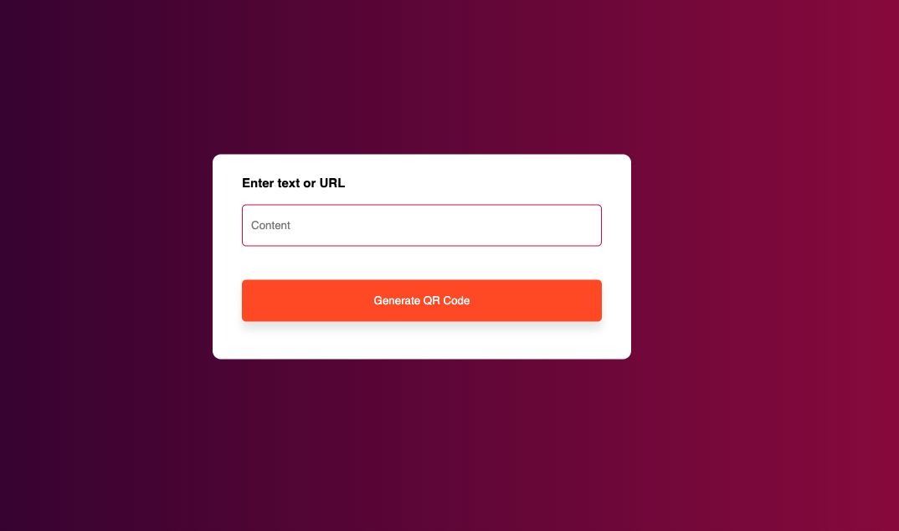
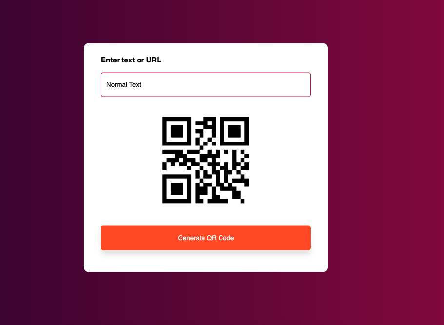

# QR Code Generator 📲

## Overview 🌟

The QR Code Generator app allows users to easily generate QR codes for text or URLs. It provides a simple interface where users can input their desired text or URL, press a button, and instantly get a QR code displayed below the input box. This README file provides detailed instructions on how to use the app effectively and highlights its key features.

## Features 🚀

- 📲 Generate QR codes for text or URLs.
- 🖥️ Simple and user-friendly interface.
- 🔄 Automatically updates the QR code when input changes.

## Screenshots 📸

*Screenshot of the QR Code Generator app without any user input.*

*Screenshot of the QR Code Generator app with a generated QR code for text.*

*Screenshot of the QR Code Generator app with a generated QR code for a URL.*

## How to Use 📖

1. **Input Text or URL:** Enter the text or URL for which you want to generate the QR code in the input box provided.

2. **Generate QR Code:** Click the "Generate QR Code" button to create the QR code for the input text or URL.

3. **View QR Code:** The generated QR code will appear below the input box. You can scan this QR code using a QR code scanner app on your mobile device.

4. **Customize QR Code (Optional):** Optionally, you can customize the QR code by selecting different colors and adjusting the size using the options provided.

## Important Notes ⚠️

- For URLs, make sure to include the complete URL including the protocol (e.g., `https://example.com`).
- QR codes are dynamically generated based on the input provided. Any changes to the input will automatically update the QR code.
- This app is designed for generating QR codes for small to medium-sized texts or URLs. For larger texts or complex data, consider using dedicated QR code generator tools.
- Make sure your input text or URL is correct before generating the QR code as there's no option to edit or undo once the code is generated.

## Try it Online 💻

You can try the QR Code Generator application online by following [this link]().

## Feedback and Support

Thank you for using the QR Code Generator app. I hope it helps you easily create QR codes for your texts or URLs. If you have any feedback, suggestions, or encounter any issues, please feel free to contact me.

Happy QR coding! 😊
